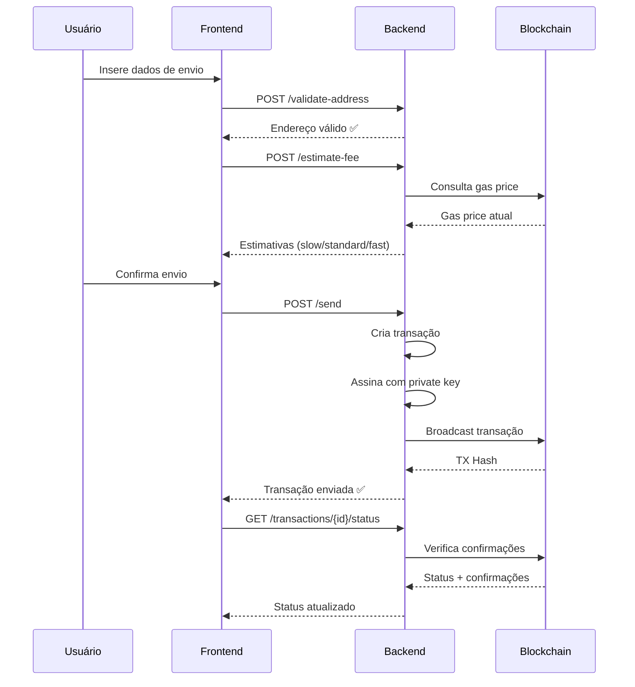

# Documentação - Endpoints de Envio de Transações

## 📋 Visão Geral

Sistema completo para envio de criptomoedas com 3 endpoints principais:

1. **Validar Endereço** - Valida formato de endereços blockchain
2. **Estimar Taxas** - Calcula gas fees para diferentes velocidades
3. **Enviar Transação** - Cria, assina e transmite transações

---

## 🔐 Autenticação

Todos os endpoints requerem autenticação JWT:

```
Authorization: Bearer <seu_token_jwt>
```

---

## 1️⃣ Validar Endereço

**Endpoint:** `POST /wallets/validate-address`

**Descrição:** Valida se um endereço é válido para uma rede específica.

### Request

```json
{
  "address": "0x742d35Cc6634C0532925a3b844Bc9e7595f0bEb",
  "network": "polygon"
}
```

### Response (200 OK)

```json
{
  "address": "0x742d35Cc6634C0532925a3b844Bc9e7595f0bEb",
  "network": "polygon",
  "valid": true,
  "message": "Address is valid"
}
```

### Redes Suportadas

- `bitcoin` - Bitcoin Network
- `ethereum` - Ethereum (ERC-20)
- `polygon` - Polygon (MATIC)
- `bsc` - Binance Smart Chain (BEP-20)
- `tron` - Tron (TRC-20)
- `base` - Base (Ethereum L2)
- `solana` - Solana
- E outras...

---

## 2️⃣ Estimar Taxas

**Endpoint:** `POST /wallets/estimate-fee`

**Descrição:** Calcula estimativas de taxa (gas fee) para 3 níveis de velocidade.

### Request

```json
{
  "wallet_id": "cdfd5281-483a-4f4b-ad70-290d65d2216d",
  "to_address": "0x742d35Cc6634C0532925a3b844Bc9e7595f0bEb",
  "amount": "5.0",
  "network": "polygon"
}
```

### Response (200 OK)

```json
{
  "wallet_id": "cdfd5281-483a-4f4b-ad70-290d65d2216d",
  "network": "polygon",
  "from_address": "0xa1aaacff9902bdaaebfbba53214bdce5d6f442e6",
  "to_address": "0x742d35Cc6634C0532925a3b844Bc9e7595f0bEb",
  "amount": "5.0",
  "fee_estimates": {
    "slow_fee": "0.0008",
    "standard_fee": "0.001",
    "fast_fee": "0.0015",
    "gas_price": "20",
    "gas_limit": 21000,
    "estimated_time": "10-60 segundos"
  },
  "currency": "MATIC"
}
```

### Níveis de Taxa

| Nível | Velocidade | Custo | Uso Recomendado |
|-------|-----------|-------|-----------------|
| `slow` | 10-30 min | Mais barato | Não urgente |
| `standard` | 2-10 min | Balanceado | Uso geral ✅ |
| `fast` | < 2 min | Mais caro | Urgente |

---

## 3️⃣ Enviar Transação

**Endpoint:** `POST /wallets/send`

**Descrição:** Cria, assina e transmite uma transação blockchain.

⚠️ **ATENÇÃO:** Esta operação é **IRREVERSÍVEL** e envolve transferência real de fundos!

### Request

```json
{
  "wallet_id": "cdfd5281-483a-4f4b-ad70-290d65d2216d",
  "to_address": "0x742d35Cc6634C0532925a3b844Bc9e7595f0bEb",
  "amount": "5.0",
  "network": "polygon",
  "fee_level": "standard",
  "note": "Pagamento de serviço",
  "password": null
}
```

### Parâmetros

- `wallet_id` *(required)* - UUID da carteira de origem
- `to_address` *(required)* - Endereço do destinatário
- `amount` *(required)* - Valor a enviar (string decimal)
- `network` *(required)* - Rede blockchain
- `fee_level` *(optional)* - Nível de taxa: `slow`, `standard` (padrão), `fast`
- `note` *(optional)* - Nota/memo da transação
- `password` *(optional)* - Senha da carteira (se aplicável)

### Response (200 OK)

```json
{
  "success": true,
  "transaction_id": 123,
  "tx_hash": "0xefcf401447f0607bee2154acaace6d090cae47614d1ca43ac0f6e7f102a339ed",
  "network": "polygon",
  "from_address": "0xa1aaacff9902bdaaebfbba53214bdce5d6f442e6",
  "to_address": "0x742d35Cc6634C0532925a3b844Bc9e7595f0bEb",
  "amount": "5.0",
  "fee": "0.001",
  "status": "pending",
  "explorer_url": "https://polygonscan.com/tx/0xefcf...",
  "estimated_confirmation_time": "2-10 minutes",
  "message": "Transaction broadcasted successfully! It may take a few minutes to confirm."
}
```

### Possíveis Erros

#### 400 Bad Request - Saldo Insuficiente
```json
{
  "detail": "Insufficient balance. Available: 3.5, Required: 5.0"
}
```

#### 400 Bad Request - Endereço Inválido
```json
{
  "detail": "Invalid polygon address"
}
```

#### 404 Not Found - Carteira Não Encontrada
```json
{
  "detail": "Wallet not found"
}
```

---

## 4️⃣ Verificar Status da Transação

**Endpoint:** `GET /wallets/transactions/{transaction_id}/status`

**Descrição:** Verifica o status de confirmação de uma transação.

### Request

```
GET /wallets/transactions/123/status
```

### Response (200 OK)

```json
{
  "transaction_id": 123,
  "tx_hash": "0xefcf401447f0607bee2154acaace6d090cae47614d1ca43ac0f6e7f102a339ed",
  "status": "confirmed",
  "confirmations": 12,
  "network": "polygon",
  "block_number": 52847391,
  "gas_used": 21000,
  "final": true
}
```

### Status Possíveis

- `created` - Transação criada mas não assinada
- `signed` - Transação assinada mas não transmitida
- `pending` - Transação transmitida, aguardando confirmação
- `confirmed` - Transação confirmada na blockchain
- `failed` - Transação falhou

---

## 🔄 Fluxo Completo de Envio



---

## 🛡️ Segurança

### Validações Implementadas

1. ✅ **Autenticação JWT** - Apenas usuário autenticado
2. ✅ **Propriedade da Carteira** - Verifica se carteira pertence ao usuário
3. ✅ **Validação de Endereço** - Formato correto para a rede
4. ✅ **Verificação de Saldo** - Saldo suficiente para valor + taxa
5. ✅ **Taxa Incluída** - Calcula automaticamente a taxa de rede
6. ✅ **Proteção de Chave Privada** - Chaves nunca expostas nas APIs

### Boas Práticas

- 🔐 **Nunca compartilhe** sua chave privada ou mnemonic
- 💾 **Faça backup** do mnemonic em local seguro
- 🧪 **Teste primeiro** com valores pequenos
- 🔍 **Verifique endereços** caractere por caractere
- ⏰ **Aguarde confirmações** antes de considerar finalizado
- 📱 **Use 2FA** quando disponível

---

## 💻 Exemplos de Código

### Python

```python
import requests

API_URL = "http://localhost:8000"
TOKEN = "seu_jwt_token"

headers = {"Authorization": f"Bearer {TOKEN}"}

# 1. Validar endereço
response = requests.post(
    f"{API_URL}/wallets/validate-address",
    headers=headers,
    json={
        "address": "0x742d35Cc6634C0532925a3b844Bc9e7595f0bEb",
        "network": "polygon"
    }
)
print(response.json())

# 2. Estimar taxas
response = requests.post(
    f"{API_URL}/wallets/estimate-fee",
    headers=headers,
    json={
        "wallet_id": "cdfd5281-483a-4f4b-ad70-290d65d2216d",
        "to_address": "0x742d35Cc6634C0532925a3b844Bc9e7595f0bEb",
        "amount": "5.0",
        "network": "polygon"
    }
)
print(response.json())

# 3. Enviar transação
response = requests.post(
    f"{API_URL}/wallets/send",
    headers=headers,
    json={
        "wallet_id": "cdfd5281-483a-4f4b-ad70-290d65d2216d",
        "to_address": "0x742d35Cc6634C0532925a3b844Bc9e7595f0bEb",
        "amount": "5.0",
        "network": "polygon",
        "fee_level": "standard"
    }
)
tx = response.json()
print(f"TX Hash: {tx['tx_hash']}")

# 4. Verificar status
response = requests.get(
    f"{API_URL}/wallets/transactions/{tx['transaction_id']}/status",
    headers=headers
)
print(response.json())
```

### TypeScript/JavaScript

```typescript
const API_URL = 'http://localhost:8000';
const TOKEN = 'seu_jwt_token';

const headers = {
  'Authorization': `Bearer ${TOKEN}`,
  'Content-Type': 'application/json'
};

// 1. Validar endereço
const validateAddress = async () => {
  const response = await fetch(`${API_URL}/wallets/validate-address`, {
    method: 'POST',
    headers,
    body: JSON.stringify({
      address: '0x742d35Cc6634C0532925a3b844Bc9e7595f0bEb',
      network: 'polygon'
    })
  });
  return response.json();
};

// 2. Estimar taxas
const estimateFee = async () => {
  const response = await fetch(`${API_URL}/wallets/estimate-fee`, {
    method: 'POST',
    headers,
    body: JSON.stringify({
      wallet_id: 'cdfd5281-483a-4f4b-ad70-290d65d2216d',
      to_address: '0x742d35Cc6634C0532925a3b844Bc9e7595f0bEb',
      amount: '5.0',
      network: 'polygon'
    })
  });
  return response.json();
};

// 3. Enviar transação
const sendTransaction = async () => {
  const response = await fetch(`${API_URL}/wallets/send`, {
    method: 'POST',
    headers,
    body: JSON.stringify({
      wallet_id: 'cdfd5281-483a-4f4b-ad70-290d65d2216d',
      to_address: '0x742d35Cc6634C0532925a3b844Bc9e7595f0bEb',
      amount: '5.0',
      network: 'polygon',
      fee_level: 'standard'
    })
  });
  const tx = await response.json();
  console.log(`TX Hash: ${tx.tx_hash}`);
  return tx;
};

// 4. Verificar status
const checkStatus = async (transactionId: number) => {
  const response = await fetch(
    `${API_URL}/wallets/transactions/${transactionId}/status`,
    { headers }
  );
  return response.json();
};
```

---

## 📊 Taxas por Rede

| Rede | Moeda | Taxa Típica | Tempo Confirmação |
|------|-------|-------------|-------------------|
| Polygon | MATIC | $0.01-$0.10 | 2-10 seg |
| BSC | BNB | $0.10-$1.00 | 3-5 seg |
| Tron | TRX | $0.01-$2.00 | 3 seg |
| Base | ETH | $0.01-$0.50 | 2 seg |
| Ethereum | ETH | $5.00-$50.00 | 15 seg - 5 min |
| Bitcoin | BTC | $1.00-$5.00 | 10-60 min |

---

## 🐛 Troubleshooting

### Erro: "Insufficient funds"
- **Causa:** Saldo insuficiente para valor + taxa
- **Solução:** Reduza o valor ou adicione mais fundos

### Erro: "Invalid address"
- **Causa:** Formato de endereço incorreto
- **Solução:** Verifique o endereço e a rede

### Erro: "Transaction failed"
- **Causa:** Problemas na blockchain (gas muito baixo, contrato revertido)
- **Solução:** Tente novamente com taxa mais alta

### Transação "pending" por muito tempo
- **Causa:** Gas price muito baixo ou rede congestionada
- **Solução:** Aguarde ou tente "speed up" (re-envio com taxa maior)

---

## 📞 Suporte

Para dúvidas ou problemas:
- 📧 Email: suporte@holdwallet.com
- 💬 Discord: HOLDWallet Community
- 📚 Documentação: https://docs.holdwallet.com

---

**Versão:** 1.0.0  
**Última Atualização:** 25/11/2025  
**Status:** ✅ Endpoints implementados e funcionais
